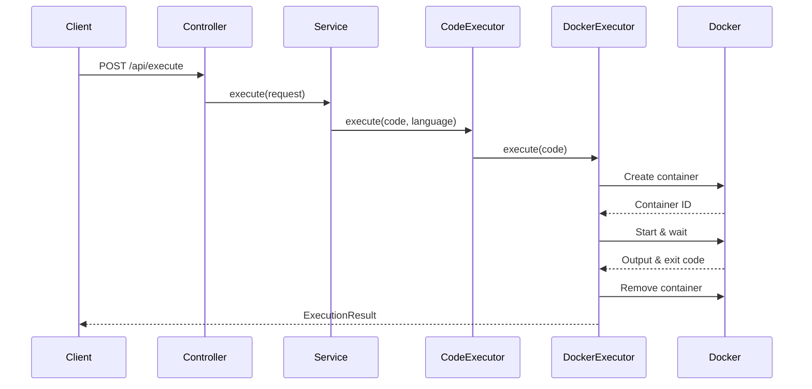

## System Architecture

Runtime is a secure code execution API service built with Spring Boot that runs user-submitted code snippets in isolated Docker containers. The system supports multiple programming languages and enforces strict resource limits to ensure security and stability.

### Core Components

The architecture consists of three main layers:

<CardGroup cols={3}>
  <Card title="API Layer" icon="cloud">
    RESTful endpoints built with Spring Boot that handle incoming code execution requests
  </Card>
  <Card title="Execution Engine" icon="gear">
    Language-specific executors that prepare and manage code execution in Docker containers
  </Card>
  <Card title="Docker Runtime" icon="docker">
    Isolated container environment where code is compiled and executed
  </Card>
</CardGroup>

### Request Flow

Here's how a code execution request flows through the system:



## Component Breakdown

### ExecutionController

The entry point for all code execution requests.

**Location:** `ExecutionController.java:22-26`

```java
@PostMapping("/api/execute")
public ApiResponse<ExecutionResult> execute(@RequestBody CodeExecutionRequest request)
{
    return executionService.execute(request);
}
```

### ExecutionService

Orchestrates the execution process by delegating to the appropriate language executor.

**Location:** `ExecutionService.java:13-17`

```java
public ApiResponse<ExecutionResult> execute(CodeExecutionRequest request)
{
    CodeExecutor ce = new CodeExecutor();
    return ce.execute(request.getCode(), request.getLanguage());
}
```

### CodeExecutor

Manages language-specific executors using a strategy pattern.

**Location:** `CodeExecutor.java:16-22`

```java
public CodeExecutor()
{
    executors.put("java", new GeneralDockerExecutor("java"));
    executors.put("python", new GeneralDockerExecutor("python"));
    executors.put("c", new GeneralDockerExecutor("c"));
    executors.put("cpp",new GeneralDockerExecutor("cpp"));
    executors.put("js",new GeneralDockerExecutor("javascript"));
}
```

### DockerExecutorUtil

Handles all Docker interactions including container creation, execution, and cleanup.

**Location:** `DockerExecutorUtil.java:24-35`

```java
public DockerExecutorUtil() {
    DefaultDockerClientConfig config = DefaultDockerClientConfig
            .createDefaultConfigBuilder()
            .withDockerHost("tcp://localhost:2375")
            .build();

    ApacheDockerHttpClient httpClient = new ApacheDockerHttpClient.Builder()
            .dockerHost(config.getDockerHost())
            .build();

    this.dockerClient = DockerClientImpl.getInstance(config, httpClient);
}
```

## Supported Languages

The system supports five programming languages, each with its own Docker image and execution command:

<AccordionGroup>
  <Accordion title="Java" icon="java">
    **Docker Image:** `eclipse-temurin:17`
    
    **Execution:** Compiles with `javac` and runs with `java`
    
    **File Naming:** Extracts class name from `public class ClassName` pattern
  </Accordion>
  
  <Accordion title="Python" icon="python">
    **Docker Image:** `python:3.11`
    
    **Execution:** Runs directly with `python main.py`
    
    **File Name:** `main.py`
  </Accordion>
  
  <Accordion title="C" icon="c">
    **Docker Image:** `gcc:latest`
    
    **Execution:** Compiles with `gcc` and executes binary
    
    **File Name:** `main.c`
  </Accordion>
  
  <Accordion title="C++" icon="c">
    **Docker Image:** `gcc:latest`
    
    **Execution:** Compiles with `g++` and executes binary
    
    **File Name:** `main.cpp`
  </Accordion>
  
  <Accordion title="JavaScript" icon="js">
    **Docker Image:** `node:18`
    
    **Execution:** Runs with `node main.js`
    
    **File Name:** `main.js`
  </Accordion>
</AccordionGroup>

## Resource Management

Every Docker container is created with strict resource limits to prevent abuse:

<CodeGroup>
```java Container Configuration
CreateContainerResponse container = dockerClient.createContainerCmd(dockerImage)
    .withCmd(command)
    .withHostConfig(HostConfig.newHostConfig()
        .withBinds(new Bind(tempDirPath, new Volume("/code")))
        .withMemory(128 * 1024 * 1024L)      // 128MB RAM
        .withNanoCPUs(500_000_000L))          // 0.5 CPU cores
    .withWorkingDir("/code")
    .exec();
```
</CodeGroup>

<Note>
These resource limits ensure fair usage and prevent individual executions from consuming excessive system resources.
</Note>

## Execution Lifecycle

1. **Temporary Directory Creation** - A unique directory is created for each execution
2. **File Writing** - Code is written to an appropriate file (e.g., `Main.java`, `main.py`)
3. **Container Creation** - Docker container is created with language-specific image
4. **Container Start** - Container starts and executes the compilation/run command
5. **Output Capture** - Both stdout and stderr are captured
6. **Container Cleanup** - Container is removed immediately after execution
7. **Directory Cleanup** - Temporary directory is deleted

<Warning>
All resources are cleaned up automatically, even if execution fails. This prevents resource leaks and ensures system stability.
</Warning>

## Next Steps

<CardGroup cols={2}>
  <Card title="Docker Execution" href="/architecture/docker-execution" icon="docker">
    Learn how Docker-based code execution works in detail
  </Card>
  <Card title="Security Features" href="/architecture/security" icon="shield">
    Understand the security and isolation mechanisms
  </Card>
</CardGroup>