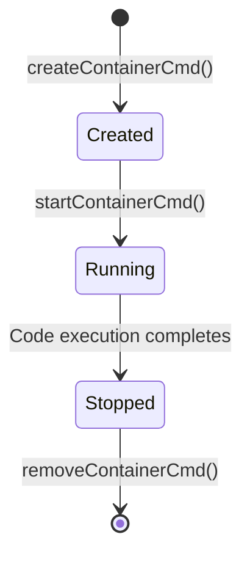

## Security Model

Runtime is designed with security as a primary concern. Every code execution runs in a completely isolated Docker container with strict resource limits and automatic cleanup to prevent abuse and system compromise.

## Isolation Layers

The system implements multiple layers of isolation:

<Steps>
  <Step title="Container Isolation">
    Each execution runs in a separate Docker container, providing process and filesystem isolation
  </Step>
  <Step title="Resource Limits">
    Strict memory and CPU limits prevent resource exhaustion attacks
  </Step>
  <Step title="Temporary Filesystem">
    Code is written to unique temporary directories that are deleted after execution
  </Step>
  <Step title="No Network Access">
    Containers run without network capabilities (default Docker behavior)
  </Step>
</Steps>

## Container Isolation

### Fresh Container Per Execution

Every code execution creates a brand new Docker container.

**Location:** `DockerExecutorUtil.java:51-58`

```java
CreateContainerResponse container = dockerClient.createContainerCmd(dockerImage)
        .withCmd(command)
        .withHostConfig(HostConfig.newHostConfig()
                .withBinds(new Bind(tempDirPath, new Volume("/code")))
                .withMemory(128 * 1024 * 1024L)
                .withNanoCPUs(500_000_000L))
        .withWorkingDir("/code")
        .exec();
```

<Info>
Containers are **ephemeral** - they exist only for the duration of code execution and are immediately destroyed afterward.
</Info>

### Container Lifecycle



**Location:** `DockerExecutorUtil.java:62-87`

```java
// Start container
dockerClient.startContainerCmd(containerId).exec();
System.out.println("Docker container started!!!");

// Wait for completion
dockerClient.waitContainerCmd(containerId).start().awaitStatusCode();

long executionTime = System.currentTimeMillis() - startTime;

// Capture output
dockerClient.logContainerCmd(containerId)
    .withStdOut(true)
    .withStdErr(true)
    .exec(/* ... */).awaitCompletion();

// Clean up container
dockerClient.removeContainerCmd(containerId).exec();
System.out.println("Docker container removed!!!");
```

<Warning>
Containers are **always** removed, even if execution fails. This prevents accumulation of stopped containers.
</Warning>

## Resource Limits

### Memory Limit: 128MB

Each container is limited to 128MB of RAM.

```java
.withMemory(128 * 1024 * 1024L)  // 128MB in bytes
```

<Accordion title="Why 128MB?">
  128MB is sufficient for most code snippets while preventing memory-intensive attacks:
  
  - Prevents infinite array allocations
  - Limits recursive function call depth
  - Stops memory leak exploits
  - Protects host system memory
  
  If code exceeds this limit, the container is killed by Docker's OOM killer.
</Accordion>

### CPU Limit: 0.5 Cores

Each container is limited to half a CPU core.

```java
.withNanoCPUs(500_000_000L)  // 0.5 cores (500 million nanoseconds)
```

<Accordion title="CPU Limit Calculation">
  Docker measures CPU in nanoseconds:
  
  - 1 CPU core = 1,000,000,000 nanoseconds
  - 0.5 cores = 500,000,000 nanoseconds
  - 0.1 cores = 100,000,000 nanoseconds
  
  This prevents:
  - Infinite loops from consuming all CPU
  - CPU-intensive cryptomining attempts
  - Fork bomb attacks
</Accordion>

### Resource Limit Enforcement

<CodeGroup>
```java Container Configuration
HostConfig.newHostConfig()
    .withBinds(new Bind(tempDirPath, new Volume("/code")))
    .withMemory(128 * 1024 * 1024L)      // Memory: 128MB
    .withNanoCPUs(500_000_000L)           // CPU: 0.5 cores
```

```bash Example: Infinite Loop
# This Python code will be CPU-throttled
while True:
    x = 1 + 1
```

```bash Example: Memory Bomb
# This will be killed by OOM killer
data = [0] * (1024 * 1024 * 1024)  # Try to allocate 1GB
```
</CodeGroup>

## Filesystem Isolation

### Temporary Directories

Each execution gets a unique temporary directory on the host.

**Location:** `DockerExecutorUtil.java:41-43`

```java
String tempDirPath = System.getProperty("java.io.tmpdir") + "/code_" + UUID.randomUUID();
Path tempDir = Paths.get(tempDirPath);
Files.createDirectories(tempDir);
```

<Card title="Example Directory" icon="folder">
  ```
  /tmp/code_a3f8c9d2-4b7e-4a1f-9c3e-8d2f1a6b5c4e/
  └── Main.java
  ```
</Card>

### Volume Binding

The temporary directory is mounted read-write into the container.

```java
.withBinds(new Bind(tempDirPath, new Volume("/code")))
.withWorkingDir("/code")
```

**Host to Container Mapping:**

```
Host:      /tmp/code_a3f8c9d2-4b7e-4a1f-9c3e-8d2f1a6b5c4e/
             ↓ (bind mount)
Container: /code/
```

<Info>
Only the specific temporary directory is accessible inside the container. The rest of the host filesystem is isolated.
</Info>

### Automatic Cleanup

Temporary directories are deleted after execution completes.

**Location:** `DockerExecutorUtil.java:88`

```java
deleteDirectory(tempDir.toFile());
```

**Cleanup Implementation:**

**Location:** `DockerExecutorUtil.java:143-149`

```java
private void deleteDirectory(File dir) {
    File[] files = dir.listFiles();
    if (files != null) {
        for (File f : files) f.delete();
    }
    dir.delete();
}
```

<Check>
**No Persistence:** Code and execution artifacts are never stored permanently. Each execution is stateless.
</Check>

## Process Isolation

### Working Directory

All code execution happens in the `/code` directory inside the container.

```java
.withWorkingDir("/code")
```

This ensures:
- Code cannot access system directories
- Compiled binaries are contained
- Output files are isolated

### User Permissions

Containers run with default Docker user permissions (typically root inside the container, but isolated from host).

<Warning>
While the container process runs as root **inside** the container, it's isolated from the host system through Docker's namespace isolation.
</Warning>

## Network Isolation

### No Network Access

By default, containers are created without network capabilities.

```java
// No network configuration = no network access
CreateContainerResponse container = dockerClient.createContainerCmd(dockerImage)
    .withCmd(command)
    .withHostConfig(/* ... */)
    .exec();
```

<Info>
The absence of network configuration means containers cannot:
- Make outbound HTTP requests
- Download additional packages
- Communicate with external services
- Scan internal networks
</Info>

## Language-Specific Security

### Trusted Base Images

All Docker images are official, trusted images from Docker Hub.

**Location:** `DockerExecutorUtil.java:119-127`

```java
private String getDockerImage(String language) {
    return switch (language.toLowerCase()) {
        case "java"   -> "eclipse-temurin:17";  // Official Eclipse Temurin
        case "python" -> "python:3.11";         // Official Python
        case "c", "cpp" -> "gcc:latest";        // Official GCC
        case "javascript" -> "node:18";         // Official Node.js
        default -> throw new IllegalArgumentException("Unsupported language: " + language);
    };
}
```

<CardGroup cols={2}>
  <Card title="eclipse-temurin:17" icon="java">
    Official OpenJDK build from Eclipse Foundation
  </Card>
  <Card title="python:3.11" icon="python">
    Official Python Software Foundation image
  </Card>
  <Card title="gcc:latest" icon="c">
    Official GNU Compiler Collection image
  </Card>
  <Card title="node:18" icon="js">
    Official Node.js Foundation image
  </Card>
</CardGroup>

### Command Injection Prevention

Commands are built programmatically, not from user input concatenation.

**Location:** `DockerExecutorUtil.java:129-141`

```java
private String[] getRunCommand(String language, String code) {
    return switch (language.toLowerCase()) {
        case "java" -> {
            String className = extractJavaClassName(code);
            // Class name is extracted via regex, not user-controlled
            yield new String[]{"sh", "-c", "javac " + className + ".java && java " + className};
        }
        case "python" -> new String[]{"sh", "-c", "python main.py"};
        case "c"      -> new String[]{"sh", "-c", "gcc main.c -o main && ./main"};
        case "cpp"    -> new String[]{"sh", "-c", "g++ main.cpp -o main && ./main"};
        case "javascript" -> new String[]{"sh", "-c", "node main.js"};
        default -> throw new IllegalArgumentException("Unsupported language: " + language);
    };
}
```

<Note>
File names are validated and constructed programmatically. User code goes into the **file contents**, not the file name or command.
</Note>

## Error Handling & Security

### Graceful Failure

All exceptions are caught and returned as safe error messages.

**Location:** `DockerExecutorUtil.java:95-97`

```java
catch (Exception e) {
    return ApiResponse.error("Execution failed: " + e.getMessage());
}
```

<Warning>
Error messages are sanitized to prevent information leakage about the host system.
</Warning>

### Container Cleanup on Failure

Even if execution fails, containers are still removed.

```java
try {
    // Container creation and execution
} catch (Exception e) {
    return ApiResponse.error("Execution failed: " + e.getMessage());
} finally {
    // Container is removed in the success path
    // Need to ensure cleanup even on exceptions
}
```

<Check>
The current implementation removes containers in the success path. For production, consider adding a `finally` block to guarantee cleanup.
</Check>

## Security Best Practices

<AccordionGroup>
  <Accordion title="Image Scanning">
    Regularly scan Docker images for vulnerabilities:
    
    ```bash
    docker scan eclipse-temurin:17
    docker scan python:3.11
    docker scan gcc:latest
    docker scan node:18
    ```
  </Accordion>
  
  <Accordion title="Resource Monitoring">
    Monitor container resource usage to detect abuse:
    
    ```bash
    docker stats --no-stream
    ```
  </Accordion>
  
  <Accordion title="Rate Limiting">
    Implement API rate limiting to prevent abuse:
    
    - Limit requests per IP address
    - Limit concurrent executions
    - Track execution metrics
  </Accordion>
  
  <Accordion title="Input Validation">
    Validate all user inputs:
    
    - Maximum code size (e.g., 10KB)
    - Allowed language values
    - Character encoding validation
  </Accordion>
</AccordionGroup>

## Security Checklist

<Steps>
  <Step title="Container Isolation">
    Each execution runs in a fresh, isolated Docker container
  </Step>
  <Step title="Resource Limits">
    128MB memory and 0.5 CPU cores per container
  </Step>
  <Step title="Network Isolation">
    No network access from containers
  </Step>
  <Step title="Filesystem Isolation">
    Unique temporary directories with automatic cleanup
  </Step>
  <Step title="Trusted Images">
    Official Docker images from verified publishers
  </Step>
  <Step title="No Persistence">
    All containers and files are deleted after execution
  </Step>
</Steps>

## Potential Improvements

<CardGroup cols={2}>
  <Card title="Execution Timeout" icon="clock">
    Add maximum execution time limit (e.g., 30 seconds)
  </Card>
  <Card title="Read-Only Filesystem" icon="lock">
    Mount code directory as read-only where possible
  </Card>
  <Card title="User Namespaces" icon="user">
    Run containers with non-root user mapping
  </Card>
  <Card title="Seccomp Profiles" icon="shield">
    Apply restrictive seccomp security profiles
  </Card>
</CardGroup>

## Next Steps

<CardGroup cols={2}>
  <Card title="Architecture Overview" href="/architecture/overview" icon="diagram-project">
    Return to the architecture overview
  </Card>
  <Card title="Deployment Guide" href="/guides/deployment" icon="rocket">
    Learn how to deploy Runtime securely
  </Card>
</CardGroup>