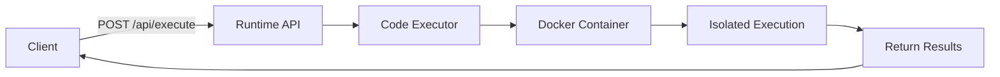

# Welcome to Runtime

Runtime is a powerful code execution API service that enables you to run code snippets securely in isolated Docker containers. Built with Spring Boot, it provides a simple REST API for executing code across multiple programming languages with built-in resource limits and security controls.

<CardGroup cols={2}>
  <Card
    title="Quickstart"
    icon="rocket"
    href="/quickstart"
  >
    Get up and running in minutes with our quick tutorial
  </Card>
  <Card
    title="API Reference"
    icon="code"
    href="/api/overview"
  >
    Explore the complete API documentation and endpoints
  </Card>
  <Card
    title="Architecture"
    icon="sitemap"
    href="/architecture/overview"
  >
    Learn how Runtime executes code securely with Docker
  </Card>
  <Card
    title="Supported Languages"
    icon="terminal"
    href="/guides/supported-languages"
  >
    See all supported programming languages and runtimes
  </Card>
</CardGroup>

## Key Features

<CardGroup cols={3}>
  <Card title="Docker-Based Isolation" icon="docker">
    Every code execution runs in its own isolated Docker container for maximum security
  </Card>
  <Card title="Multi-Language Support" icon="layer-group">
    Execute code in Java, Python, C, C++, and JavaScript
  </Card>
  <Card title="Resource Limits" icon="gauge">
    Built-in memory and CPU constraints prevent resource exhaustion
  </Card>
  <Card title="REST API" icon="plug">
    Simple HTTP API built with Spring Boot for easy integration
  </Card>
  <Card title="Execution Tracking" icon="clock">
    Get detailed execution time metrics for every code run
  </Card>
  <Card title="Automatic Cleanup" icon="broom">
    Containers are automatically cleaned up after execution
  </Card>
</CardGroup>

## How It Works

Runtime accepts code snippets through a REST API endpoint, dynamically spins up a Docker container for the specified language, executes the code in isolation, and returns the output along with execution metrics.

<Note>
  Runtime requires Docker to be installed and running on the host system. See the [Setup Guide](/guides/setup) for installation instructions.
</Note>

## Use Cases

- **Online Coding Platforms**: Execute user-submitted code safely in educational or interview platforms
- **Code Testing Services**: Run automated tests in isolated environments
- **Serverless Functions**: Deploy lightweight code execution as a service
- **API Testing**: Execute code snippets for API testing and validation

## Next Steps

<CardGroup cols={2}>
  <Card title="Quick Tutorial" icon="play" href="/quickstart">
    Execute your first code snippet in under 5 minutes
  </Card>
  <Card title="Setup Guide" icon="wrench" href="/guides/setup">
    Install and configure Runtime for your environment
  </Card>
</CardGroup>
